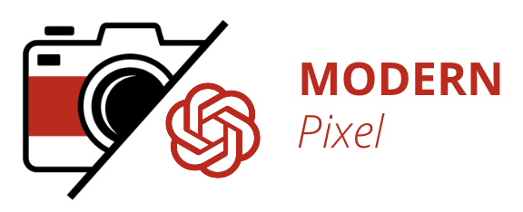

# Modern_Pixel 📸

<p align="center">
  
</p>

Introducing Modern Pixel: Your All-in-One AI Image Generation Solution

Experience the power of Modern Pixel, a cutting-edge Full Stack AI Image Generation MERN Application. Our sleek and intuitive user interface, powered by Vite.js and React.js, ensures a seamless and delightful user experience.

Harnessing the capabilities of the OpenAI Dall-E API, Modern Pixel empowers you to create stunning images with ease. Share your creations with our vibrant community through the dedicated community page, fostering inspiration and collaboration.

Our state-of-the-art image hosting relies on the robust Cloudinary Service, guaranteeing accessibility and reliability. Every facet of your creative journey is safeguarded, as we securely store image data, user information, and utilized prompts within a resilient MongoDb Atlas Database.

    Elevate your image generation experience with Modern Pixel - " Where innovation meets Artistry."

<hr />

## Technolgies used :
<p>
    <a href="https://vitejs.dev/" target="_blank">
      
    </a>
    <a href="https://react.dev/" target="_blank">
      
    </a>
    <a href="https://nodejs.org" target="_blank">
      
    </a>
    <a href="https://expressjs.com/" target="_blank">
      
    </a>
    <a href="https://www.mongodb.com/" target="_blank">
      
    </a>
    <a href="https://openai.com/" target="_blank">
      
    </a>
    <a href="https://cloudinary.com/" target="_blank">
      
    </a>
</p>

## 🏍 To use , view or run the code :

<p align="center">
  
</p>
<br>

- Clone / Download :
```
git clone https://github.com/your_username_/Project-Name.git
```

- Open the project in your favorite code editor and in both the client and server directory, do this :

```
npm install
```
  
- In the server directory, create a new <code>.env</code> file and add following environment variables :

```
MONGODB_URL: your_mongodb_connection_string
PORT: Port of your choice ( eg: 8000 )
OPENAI_API_KEY = your_open_ai_api_key
CLOUDINARY_CLOUD_NAME = your_cloudinary_cloud_name
CLOUDINARY_API_KEY = your_cloudinary_api_key
CLOUDINARY_API_SECRET = your_cloudinary_api_secret
```

## ✍ Contributing :

Contributions are what make the open source community such an amazing place to be learn, inspire, and create. Any contributions you make are greatly appreciated.

- Fork the Project
- Create your new Branch <code> git checkout -b NewBranchName </code>
- Commit your Changes <code> git commit -m " Description of contribution you made " </code>
- Push to the Branch <code> git push origin NewBranchName </code>
- Open a Pull Request
